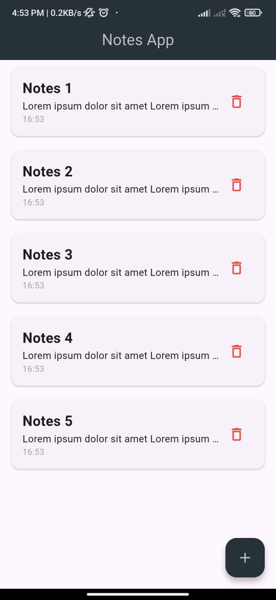

# Notes App

| Name                         | NRP        | Class |
|------------------------------|------------|-------|
| Muhammad Gesang Ridho Widigdo| 5025221216 | C     |

## Fitur Aplikasi

- Menambahkan Note baru
- Mengupdate Note
- Menghapus Note
- Menampilkan Note dalam bentuk *List of Cards*

Link Youtube: https://youtu.be/sj3jEb15XBQ

## Referensi

OpenAI. (2025). _ChatGPT (diakses 25 Maret)_. https://openai.com/chatgpt

> Saya menggunakan ChatGPT untuk mencari bagaimana cara membuat suatu fitur bekerja dan mencari apa yang salah di kode saya saat ada bug atau error pada aplikasi